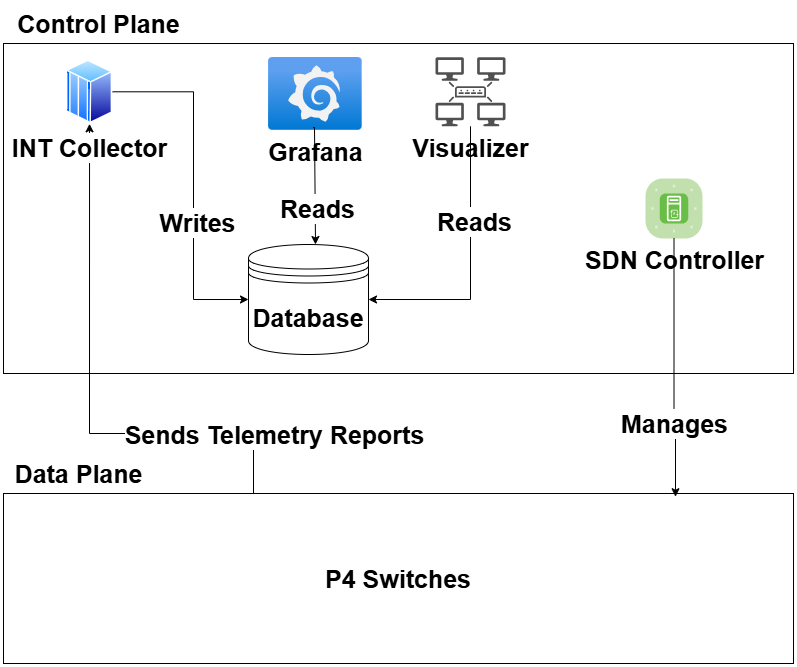
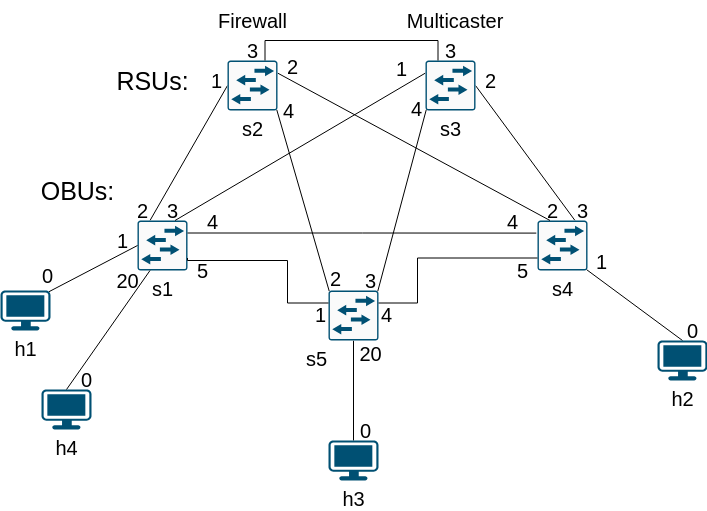

# P4-SFC-SDN
This work was performed in the scope of the project MH-SDVanet: Multihomed Software Defined Vehicular Networks (reference PTDC/EEI-COM/5284/2020).<br/>


Fork of the project [multip4/P4-SFC](https://github.com/multip4/P4-SFC), more exactly this version [davidcc73/P4-SFC](https://github.com/davidcc73/P4-SFC) and its corrections, `multip4/P4-SFC` implements SFC using P4 switches with no SDN Controller.


This repository aims to expand that project by adding to it: <br/>
 * Docker and ONOS, to migrate it to Docker Containers and ONOS Controller, responsible for the pushing of the P4 Pipelines and the Table entries.
 * `In-band Network Telemetry (INT)`, selected data flows, defined by ONOS, will generate Telemetry. <br/>
 * `Grafana Dashboard`, using the collected INT in the DB, represent it via real-time graphs. <br/>
 * `Visualizer`, a Python script that reads the INT data and represents the paths currently taken by the data flows in the topology. <br/>
  * `INT Collector`, a Python script that sniffs the INT Report packets and stores their indormation in the Database. <br/>


# Repository structure
This repository is structured as follows: <br/>
 * `app/` ONOS app Java implementation <br/>
 * `config/` configuration files <br/>
 * `INT/` Contains all the programs that use the INT: `Grafana`, `Visualizer` <br/>
 * `mininet/` Mininet scripts to emulate a topology of `stratum_bmv2` devices <br/>
 * `images/` Contains the images used on this ReadMe file. <br/>
 * `p4src/` P4 implementation <br/>
 * `Commands/` Contains files with CLI commands for testing <br/>
 * `utils/` utilities include dockerfile and wireshark plugin <br/>
 * `tmp/` temporary directory that contains the logs from `ONOS` and the `P4 Switches`<br/>

# Architecture



This repository is structured as follows: <br/>
 * `Docker` Runs 2 conrtainers, one for mininet with the topology, other for ONOS controller and it's CLI. The mininet switches have a direct connection to ONOS. <br/>
 * `ONOS` is the SDN controller used, contains a CLI to access it's opeartions, for details see [ONOS](#ONOS) section. <br/>
 * `Mininet`, programm used to simulate the network topology, all switches use the same P4 code, and the used virtual interfaces are native to the System that hosts the Docker engine, for details see [Mininet](#Mininet) section. <br/>
 * `InfluxDB`, is the used database to store the collected INT data, for details see [Database](#Database) section. <br/>
 * `Grafana`, is tools used to visualize, in real-time, the collected telemetry in the form of graphs, for details see [Grafana](#Grafana) section. <br/>
 * `Visualizer`, python script that reads the Database and processes the data to represent, in real-time, which paths in our topology each data flow is taking, for details see [Visualizer](#Visualizer) section. <br/>
  * `INT Collector`, python script that sniffs the packets from the topology switches' interfaces that are facing the INT collector, for details see [INT Collector](#INT-Collector) section.<br/>

# Topology

The topology created by `mininet` is defined at `config/topology.json`, while the topology view of the `ONOS` controller is defined at `config/netcfg.json`, the 2 must coincide if intended to expand the ONOS functions in the future.

Our Topology:




# Setup

For the developemnt of this project we used Ubuntu LTS 22.04, and LTS 24.04, so the presented commands are meant to it.
Any Linux Distro capable of installing the needed programs should work fine.

### Install Docker Engine
For Ubuntu the process is different from other distros, so it's recommened to follow the official instruction [here](https://docs.docker.com/engine/install/ubuntu/).

### Install Dependencies
In any location run:

```bash
sudo apt-get install sshpass              #install sshpass to be able to use the make commands
sudo apt install python3-scapy -y         #send/process packets
sudo apt install mininet                  #install mininet at host (makes clean ups easier)
sudo apt install python3-openpyxl -y      #to export raw CSV results to excel
sudo apt install python3-networkx -y      #to visualize the network flows in the topology in real-time
sudo apt install python3-matplotlib -y    #to visualize the network flows in the topology in real-time
```
In the root of the project run:
```bash
#Install our container's dependencies
sudo make deps                   
```

### Install InfluxDB
We used InfluxDB v.1.8. The installation process can be seen [here](https://docs.influxdata.com/influxdb/v1/introduction/install/).

```bash
#A client for Python to interact with InfluxDB.
sudo apt install python3-influxdb -y

#enable influxdb to start on boot
sudo systemctl enable influxdb  
```

Create the int database
```bash
#connect to InfluxDB
influx

#create the DB for the INT telemetry
influx> create database int

#(optional) Check if the DB was created 
influx> use int
```


### Install Grafana
The installation process can be seen [here](https://grafana.com/docs/grafana/latest/setup-grafana/installation/debian/#install-from-apt-repository), we used "Install from APT repository".


After installing, run:

```bash
#start grafana now
sudo systemctl start grafana-server 

#enable grafana-server to start on boot
sudo systemctl enable grafana-server
```

The Web Interface can be accessed at http://localhost:3000/<br/>
username: admin<br/>
password: admin


#### Connect to InfluxDB

Go to Connections > Data sources, select InfluxDB and use the default url: http://localhost:8086<br/>
Select the database int<br/>
usernmae: admin<br/>
password: admin<br/>
Test and if all is ok, you will see the message of success

#### Import Dashboard
After configuring the data source, copy it's uID (unique ID), that can be seen at the URL after "/datasources/edit/"
and paste it at the file "INT/grafana/INT statistics.json" at all variables "uid", replace the old value.

Go to Home > Dashboards > Import dashboard and upload the Grafana Dashboard .json "INT/grafana/INT statistics.json"

### Wireshark (Optional)
To help dissecting INT reports, install wirehsark plugin located at "util/wireshark/P4INT_report_IPV4.lua"<br/>
into <br/>"/usr/lib/x86_64-linux-gnu/wireshark/plugins/"

It's limited to a fixed number of hops, but is easy to modify to a different number and to new report's fields.

Some data is displeyed incorrectly, trust the one printed by the INT collector.


### Install Docker Engine
For Ubuntu the process is different from other distros, so it's recommened to follow the official instruction [here](https://docs.docker.com/engine/install/ubuntu/).

### Install Dependencies
In any location run:

```bash
sudo apt-get install sshpass     #install sshpass to be able to use the make commands
sudo pip3 install mininet        #install mininet at host (makes clean ups easier)
```
In the root of the project run:
```bash
#Install our container's dependencies
sudo make deps                   
```


# Implementation

## Visualizer
Python script that visually represents our topology and distinguishs between paths taken by the currently circulating flows, including multicasting, we use the `Networkx` library. 

The topology structure is manually configured before running the script. 

It retrieves from the database the last 1 second of entries from table `flow_stats`, one entry per packet, every 0.5 seconds the topology representation is updated, and if a flow does not have an entry in the period of 0.1 seconds it's considered as finished and its path is no longer draw.

The script represents:<br/>

* The existing connections between nodes.
* Associates 1 color to each data flow.
* Creates numbered and colored arrows between nodes, to specify their direction.
* Path changes.


## Mininet

### Stratum Image
The stratum image used is a custom image of stratrum version: `2022-06-30` built from source by modifying the `Dockerfile`
by adding X11, pip3 at runtime and scapy to it (new version at util/docker/stratum_bmv2/Dockerfile).

If needed to recompile the image, drop de Dockerfile at /tools/mininet/, the current image was compiled with name:`davidcc73/ngsdn-tutorial:stratum_bmv2_X11_scapy`
(the official installation script contains some small naming errors that will pop up during compilation).

The custom image was published at docker hub, and is pulled from there, by doing `make deps`, and can be seen [here](https://hub.docker.com/r/davidcc73/stratum_bmv2_x11_scapy_pip3).


### Interfaces
`TODO`


## ONOS
Our custom ONOS' CLI commands:

| Command           | Description   |
|-------------------|---------------|
| table_add      | Insert a table rule on a specifi switch |

## P4
All switches P4 enabled (based on [bmv2](https://github.com/p4lang/behavioral-model) P4 software implementation)

P4 Logs are located at `tmp/switchID/stratum_bmv2.log`, can be created by doing:
 * log_msg("User defined message");
 * log_msg("Value1 = {}, Value2 = {}",{value1, value2});


## Make Commands

| Command    | Description |
|------------|-------------|
| `default`         | Asks to specify a target |
| `_docker_pull_all`| Pulls and tags all required Docker images |
| `deps`            | Calls `_docker_pull_all` |
| `start`           | Starts ONOS and Mininet, creates necessary directories |
| `stop`            | Stops/Deletes the Docker Containers |
| `restart`         | Calls `stop` and then `start`         |
| `reset`           | Calls `stop` and removes temporary files/directories | 
| `netcfg`          | Pushes the `netcfg.json` network configuration to ONOS via REST API | 
| `mn-host`         | Executes a command inside the Mininet container |
| `onos-cli`        | Connects to the ONOS CLI using `sshpass` (non-secure connection with warnings)                      |
| `onos-log`        | Follows the ONOS logs from Docker Compose             |
| `onos-ui`         | Opens the ONOS web UI in a browser (`http://localhost:8181/onos/ui`)  |
| `mn-cli`          | Attaches to the Mininet CLI (detachable with Ctrl-D) |
| `mn-log`          | Follows the logs of the Mininet container |
| `clean`           | Cleans up logs and build artifacts (P4 and ONOS app builds) |
| `app-build`       | Calls in sequence `p4-build` `_copy_p4c_out` `_mvn_package`   |
| `p4-build`        | Compiles the P4 program and generates the P4Runtime and BMv2 JSON files |
| `_copy_p4c_out`   | Copies the compiled P4 artifacts to the ONOS app resources directory   |
| `_mvn_package`    | Builds the ONOS app using Maven inside a Docker container |
| `app-reload`      | Calls `app-uninstall` and `app-install`  |
| `app-install`     | Installs and activates the ONOS app on the ONOS controller.                                          |
| `app-uninstall`   | Uninstalls the ONOS app from the ONOS controller (if present).                                       |
| `yang-tools`      | Runs YANG tools on the specified YANG model inside a Docker container.                               |


# Usage
## Clear Previous Executions

```bash
sudo make stop     #Stop/Delete the mininet and ONOS containers
sudo mn -c         #Delete virtual interfaces that mininet created
sudo make clean    #Delete Previous P4 and ONOS Builds compilations
```

## Boot Up

```bash
xhost +               #Enable X11 forwarding
sudo make start       #Start ONOS and mininet containers
sudo make app-build   #Compile P4 code and ONOS apps and push its .oar executable to ONOS
```

This will create the `srv6-uSID-1.0-SNAPSHOT.oar` application binary in the `app/target/` folder. <br/>
Moreover, it will compile the p4 code contained in `p4src` creating two output files: <br/>
- `bmv2.json` is the JSON description of the dataplane programmed in P4; <br/>
- `p4info.txt` contains the information about the southbound interface used by the controller to program the switches. <br/>
These two files are symlinked inside the `app/src/main/resources/` folder and used to build the application. <br/>


## Firewall
The node s2 is defined to act as a L3 firewall, it reads the packet's `IPv4.dstAddr` and drops if it does not match any of the IPs on its L3 firewall table, the IPs in the table are the ones from all the hosts in the topology.

The table entries with the IPs, are given to the switch via its configuration file.

## Multicaster
The node s3 is defined to act as a Multicaster, if the packet has no more `SFC` header (either from s3 being its last node and decapsulated it or the packet did not have it on arrival), s3 reads the packet's `IPv4.DSCP` and if it matches one of the configured values, the packet will be manipulated to go from a unicast to a multicast one, to which both s3 and the other switches will read its `ethernet.dstAddr` to determine to which multicast group it belongs, and forward it accordingly.

<strong>Currently Programmed Multicast Conversion:</strong>

| DSCP  | new DST MAC Address| new DST IP Address |
|-------|--------------------|--------------------|
|51     |01:00:5E:00:00:01   |239.1.1.1           |
|52     |01:00:5E:00:00:02   |239.1.1.2           |


## Multicasting/Broadcast
By default all links at `config/netcfg.json`, are added to a multicast group `255` used for broadcasting, its up for the P4 code to prevent loops, like it currently does with `LLDP` broadcast packets.

All the remaining multicast configurations are done via cli commands, and are located at directory `config/rules_mcast`

The remaining groups are set mannually via the commands `mcast_port_add` in which a device will associate its given ports to a multicast group. The ports were defined to take the possible shortest path from the `multicaster` node to the destination hosts.

Each node detects the multicast packet by reading its `ethernet.dstAddr` and associating it to a group.

<strong>Currently Programmed Multicast Groups and their Ports per device:</strong>

|Group\Node|s1  |s2|s3   |s4|s5|
|----------|----|--|-----|--|--|
|1         |1,20|--|1,2,4|1 |20|
|2         |20  |--|1,2  |1 |--|
|255       |All|All|All|All|All|


## SFC
The last node in the chain is responsible for decapsulation of SFC and will forward the pkt using IPv4.

Not all nodes need to be in the chain, there is support for intermediary nodes, by reading the current `sf` in the top of the chain (next service to be applyed).

At decapsulation, DSCP is set to 0, to avoid re-encapsulation at the nodes that can do it.

<strong>Currently Programmed Chains:</strong>

| DSCP  | IP Precedence | Nodes to Travel to before DST |
|-------|---|-----------------|
| 1     | 0 | s1              |
| 2     | 0 | s2              |
| 3     | 0 | s3              |
| 4     | 0 | s4              |
| 5     | 0 | s5              |
| 10    | 1 | s2 -> s3        |
| 11    | 1 | s3 -> s2        |
| 12    | 1 | s2 -> s3 -> s4  |
| 13    | 1 | s2 -> s4        |
| 14    | 1 | s5 -> s4        |
| 15    | 1 | s2 -> s3 -> s1  |
| 16    | 2 | s2 -> s1        |
| 40    | 5 | s3 (ends SFC, converts to multicast) -> hosts: h2, h4         |
| 51    | 6 | s2 -> s3 (ends SFC, converts to multicast) -> hosts: all      |
| 52    | 6 | s2 -> s3 (ends SFC, converts to multicast) -> hosts: h2, h4   |
| Others    | - | None        |


## ONOS Apps and Connections
After ONOS boots, run:
```bash
make app-reload       #Push ONOS apps to ONOS, so it can be registered
make netcfg           #Push mininet topology to ONOS
```


ONOS gets its global network view thanks to a JSON configuration file in which it is possible to encode several information about the switch configuration. <br/>

This file is parsed at runtime by the application and it is needed to configure, e.g. the MAC addresses, SID and uSID addresses assigned to each P4 switch. <br/>

Now ONOS knows how to connect to the switches set up in mininet. <br/>


## ONOS Configuration
Connect to ONOS CLI by doing `sudo make onos-cli` and run:

### Basic Configuration:
```bash
# Push IPv4 rules to each switch          
source /config/IPv4/s1.txt 
source /config/IPv4/s2.txt
source /config/IPv4/s3.txt
source /config/IPv4/s4.txt
source /config/IPv4/s5.txt
```


# Now select ONLY ONE set of commands to define how detours should be done
```bash
# Push SFC rules to each switch          
source /config/SFC/s1.txt 
source /config/SFC/s2.txt
source /config/SFC/s3.txt
source /config/SFC/s4.txt
source /config/SFC/s5.txt

# Push Mcast rules to each switch  
source /config/rules_mcast/s1.txt 
source /config/rules_mcast/s2.txt
source /config/rules_mcast/s3.txt
source /config/rules_mcast/s4.txt
source /config/rules_mcast/s5.txt
```


## Tests
`TODO`


### ONOS UI
ONOS web UI has a graphical representation of the running topology from the controller point of view. <br/>

Then, return to the UI and press <br/>
* `h` to show the hosts <br/>
* `l` to display the nodes labels <br/>
* `a` a few times until it displays link utilization in packets per second <br/>

Currently ONOS UI does not represent the links between switchs because we are not using LLDP.


# Original P4-SFC ReadMe

## High Performance and High available Service Function Chaining in Programmable Data Plane

This is a P4 (P4_16) implementation of service function chaining 
Our implementation includes the following SFC core components and functions.

* Classifier
  * Service Function Path assignment
  * SFC encapsulation
* Service Function Forwarder (SFF)
  * SF forwarding
  * SFC Decapsulation

### System Requirements
* Ubuntu 14.04+
* [P4 BMv2](https://github.com/p4lang/behavioral-model)
* [p4c](https://github.com/p4lang/p4c)
* [p4Runtime](https://github.com/p4lang/PI)

We highly recommend to use [a VM of P4 tutorials](https://github.com/p4lang/tutorials/tree/sigcomm18-final-edits) that has all of the required software installed.

Note that this implementation has only been tested in BMv2.
Therefore, it may not work as is on production P4-enabled programmable switches.

